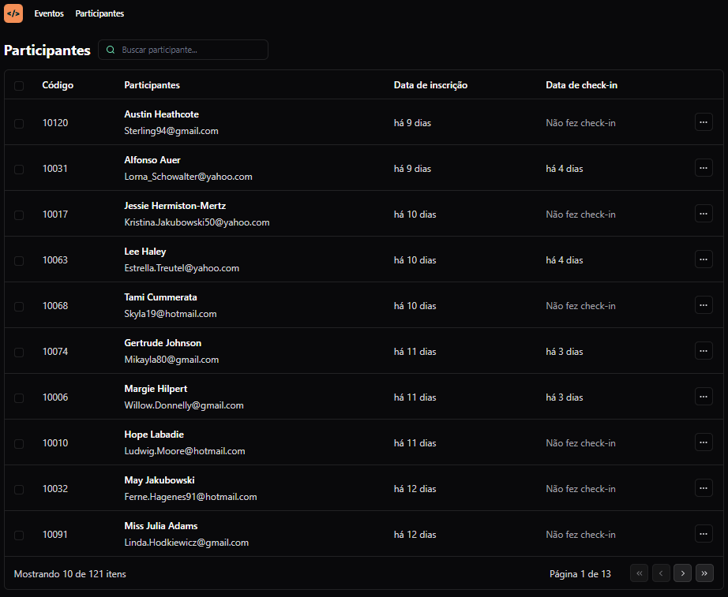

<h1 align="center"> Pass in </h1>

Este é um projeto desenvolvido no evento NLW Unite, trilha React da Rocketseat.

  <a href="#-tecnologias">Tecnologias</a>&nbsp;&nbsp;&nbsp;|&nbsp;&nbsp;&nbsp;
  <a href="#-projeto">Projeto</a>&nbsp;&nbsp;&nbsp;|&nbsp;&nbsp;&nbsp;
  <a href="#-layout">Layout</a>&nbsp;&nbsp;&nbsp;|&nbsp;&nbsp;&nbsp;
  <a href="#memo-licença">Licença</a>

  

 

## 🚀 Tecnologias

Esse projeto foi desenvolvido com as seguintes tecnologias:

- TypeScript
- ReactJS
- Figma
- Tailwind CSS
- IconFinder
- SQL
- Git e Github

## 💻 Projeto

O Pass in é uma aplicação de gestão de participantes em eventos. Contém o deshboard do organizador do evento, central de vizualização dos participantes, código de inscrição, data de inscrição, data de check-in e permite pesquisa por nome. Possui lógica URL state, permitindo compartilhar URL com histórico de pesquisa.

## 🔖 Layout

Você pode visualizar o layout do projeto através [DESSE LINK](https://www.figma.com/community/file/1356738933008624188/pass-in). É necessário ter conta no [Figma](https://figma.com) para acessá-lo.

---

### Rodando o projeto:

- npm run dev

---

## :memo: Licença

Esse projeto está sob a licença MIT.

Feito com ♥ by Rocketseat :wave: [Participe da nossa comunidade!](https://discord.gg/rocketseat)
